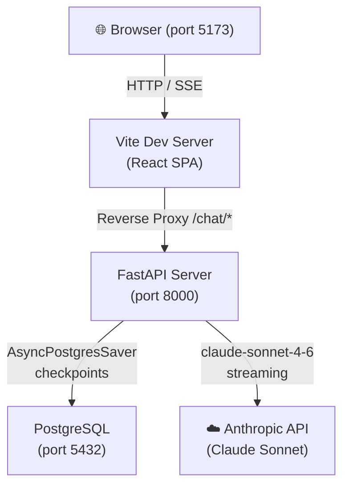
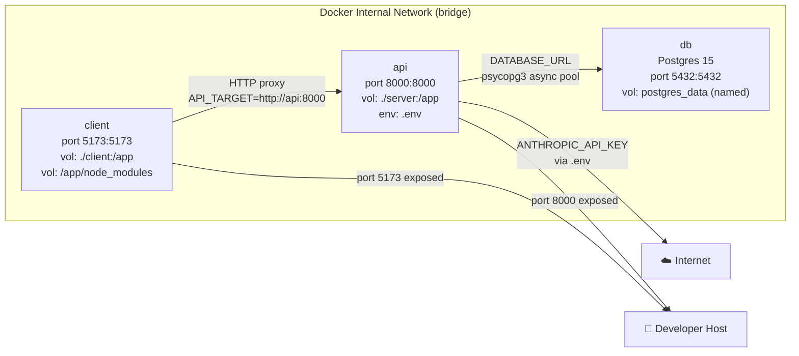
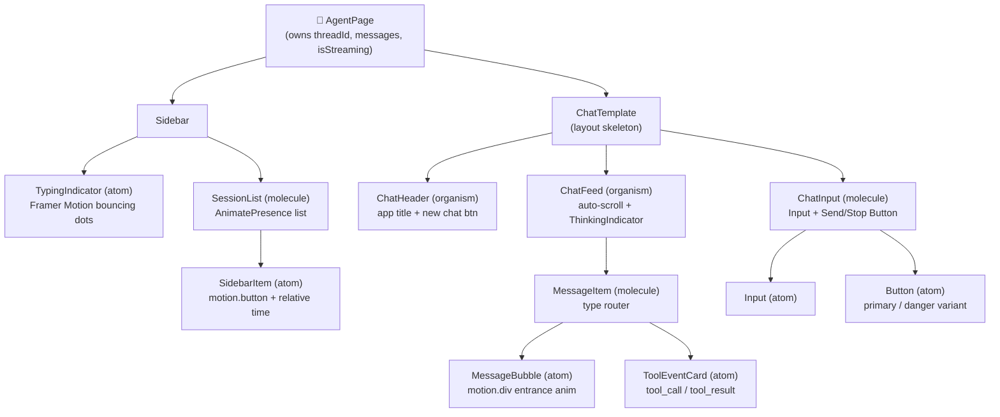
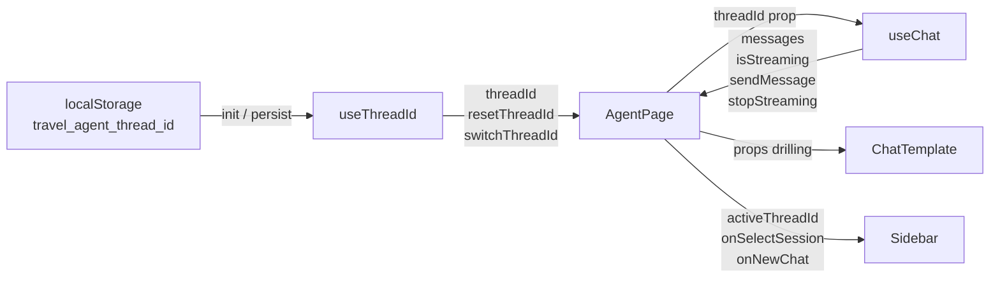
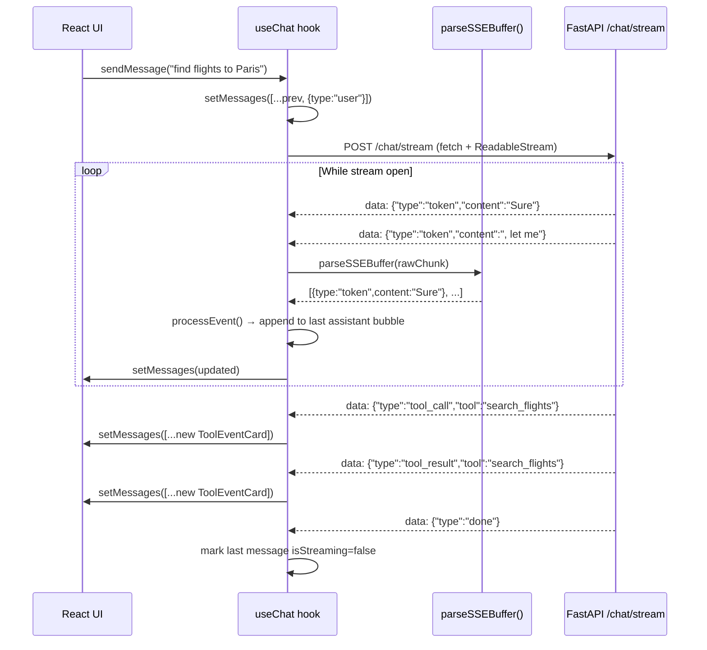
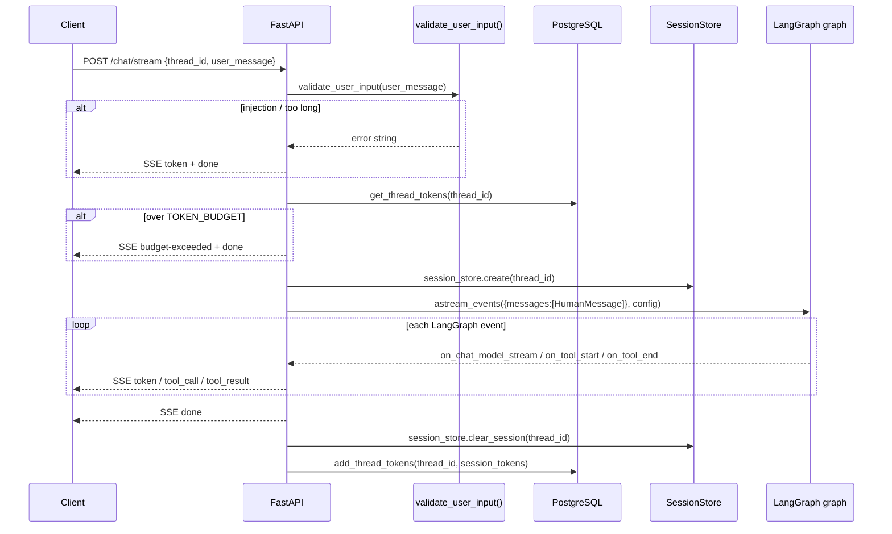
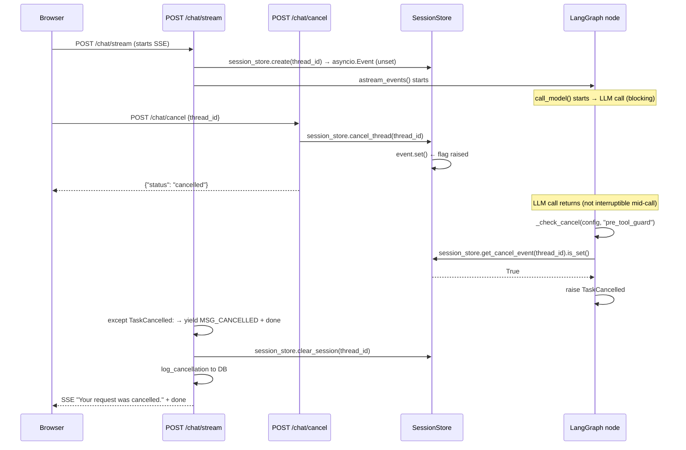
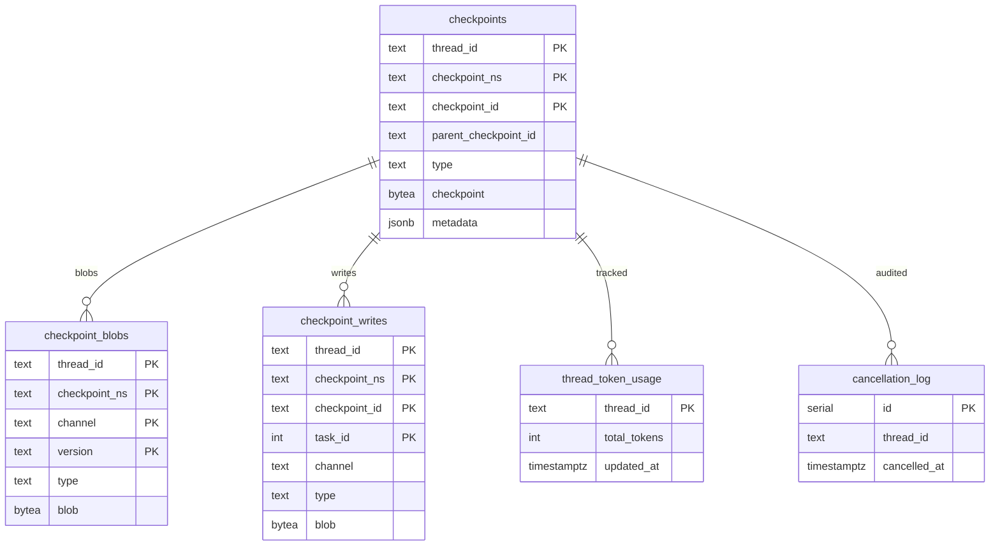
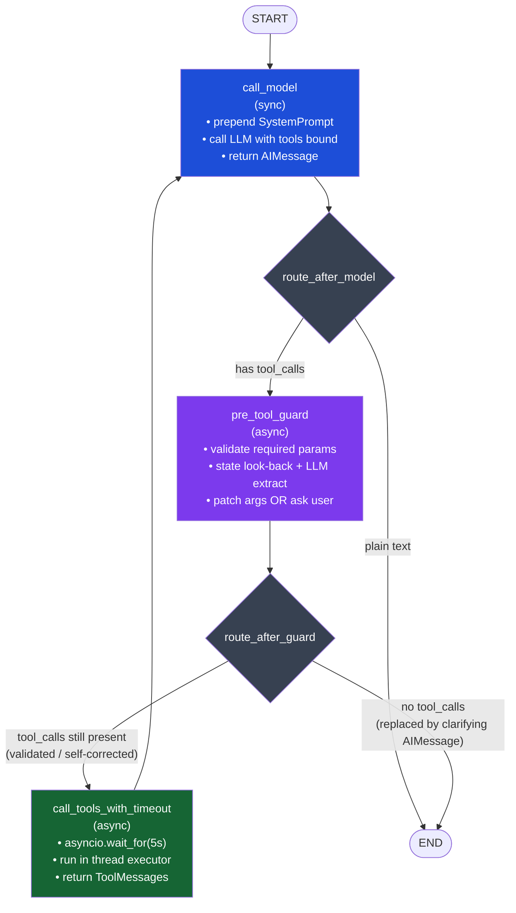
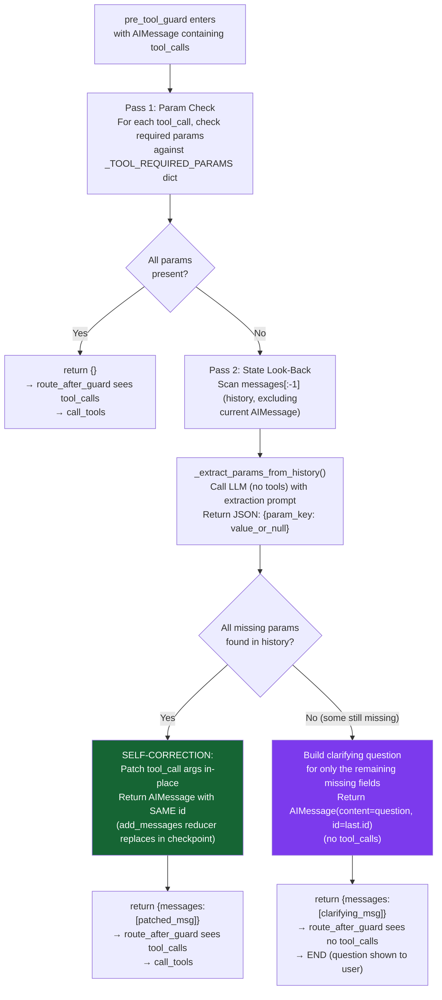

# AI Travel Agent — Comprehensive Architecture Document

> **Purpose:** Technical interview preparation. Every design decision, pattern, and trade-off is explained in depth so you can discuss the "Why" and the "How" behind every component.

---

## Table of Contents

1. [System Overview](#1-system-overview)
2. [Infrastructure & Container Orchestration](#2-infrastructure--container-orchestration)
3. [Frontend Architecture](#3-frontend-architecture)
4. [Backend Architecture](#4-backend-architecture)
5. [Persistence Layer](#5-persistence-layer)
6. [Agentic Workflow — LangGraph Core](#6-agentic-workflow--langgraph-core)
7. [Safety, Reliability & Cost Guards](#7-safety-reliability--cost-guards)
8. [Key Engineering Challenges Solved](#8-key-engineering-challenges-solved)

---

## 1. System Overview

### What It Is

A production-grade AI Travel Agent that:
- Holds **multi-turn, persistent conversations** across browser refreshes and sessions
- Streams LLM responses token-by-token in real time via **Server-Sent Events**
- Executes **tool calls** (flight search, hotel search) inside a ReAct agent loop
- Validates tool parameters with a **Pre-Tool Guard** before every execution
- Supports **hard cancellation** from the browser all the way to the LLM loop
- Enforces **safety guards**: prompt injection detection, token budgets, recursion limits

### High-Level Architecture



---

## 2. Infrastructure & Container Orchestration

### Docker Compose — Three-Container Stack

```yaml
# docker-compose.yml (abridged)
services:
  client:   # React + Vite dev server
  api:      # FastAPI + LangGraph agent
  db:       # PostgreSQL 15
```



### Key Infrastructure Decisions

**Named volume for `node_modules`**
```yaml
volumes:
  - ./client:/app          # mounts source code (hot-reloads)
  - /app/node_modules      # anonymous volume keeps container's node_modules
```
> **Why:** Without the anonymous volume override, Docker would mount the host's `node_modules` into the container, causing platform-specific binary mismatches (e.g., native C extensions compiled for macOS running on Alpine Linux inside the container). The anonymous volume ensures the container installs its own native modules at build time and keeps them isolated.

**Health-check dependency**
```yaml
depends_on:
  db:
    condition: service_healthy
```
The API container waits for `pg_isready` to succeed before starting. This prevents a race condition where FastAPI tries to open the connection pool before Postgres finishes initialising its data directory — a common failure mode with cold-start containers.

**Named `postgres_data` volume**
Data survives container restarts and rebuilds. Destroying data requires an explicit `docker volume rm`, making accidental data loss impossible during development.

**Vite reverse proxy**
```typescript
// vite.config.ts
proxy: {
  '/chat': { target: API_TARGET, changeOrigin: true },
  '/health': { target: API_TARGET, changeOrigin: true },
}
```
> **Why not CORS?** Instead of enabling CORS on the FastAPI server and having the browser hit port 8000 directly, all `/chat/*` requests are proxied through the Vite dev server. This mirrors a production nginx/load-balancer setup where the frontend and API share the same origin, eliminating CORS entirely and making the browser think everything is same-origin.

`API_TARGET` is injected by Docker Compose (`http://api:8000`) — the container service name resolves via Docker's internal DNS. Local development without Docker falls back to `http://localhost:8000`.

---

## 3. Frontend Architecture

### Technology Stack

| Concern | Library | Version |
|---|---|---|
| UI Framework | React | 18.3.1 |
| Build Tool | Vite | 5.4.2 |
| Type Safety | TypeScript | 5.5.3 |
| Animations | Framer Motion | 12.40.0 |
| Server State | TanStack React Query | 5.56.2 |
| ID Generation | uuid | 10.0.0 |

### 3.1 Atomic Design Component Hierarchy

The entire UI is structured using **Brad Frost's Atomic Design methodology**, which creates a strict, one-directional component tree. Each level can only import from levels below it — never above.

```
Atoms       → smallest, stateless, single-purpose UI units
Molecules   → compose 2+ atoms into a functional group
Organisms   → compose molecules + atoms into a complete UI section
Templates   → layout skeleton wiring organisms together
Pages       → owns all application state, passes down via props
```



**3-file rule per component:** every component folder contains exactly:
- `ComponentName.tsx` — JSX and logic
- `ComponentNameStyles.ts` — all `CSSProperties` objects (no inline style literals in JSX)
- `ComponentNameConstants.ts` — string literals, magic numbers, enums

> **Why separate styles from constants?** Styles change for visual reasons; constants change for copy/logic reasons. Keeping them separate means a designer editing pixel values never touches business strings, and a writer changing labels never touches layout code.

### 3.2 State Architecture



**`useThreadId` hook** manages a single UUID that identifies the active conversation thread. It is:
- **Initialised lazily** from `localStorage` on first render (survives refresh)
- `resetThreadId()` — generates a new UUID via `uuidv4()` (new chat)
- `switchThreadId(id)` — loads an existing session from the sidebar

**`useChat` hook** owns all message state. Key design decisions:

1. **`AbortController` ref** — not React state. Stored in a `useRef` to avoid triggering re-renders when updated. Holds the abort signal for the current in-flight SSE fetch.

2. **`useMutation` from React Query** — wraps the streaming function. Its `isPending` boolean drives the `isStreaming` state exposed to the UI, giving a single source of truth for "is the agent currently running?"

3. **History load with stale-update prevention:**
```typescript
useEffect(() => {
  abortRef.current?.abort()   // kill any active stream
  setMessages([])
  let cancelled = false       // closure variable — not React state

  fetch(`/chat/history?thread_id=${encodeURIComponent(threadId)}`)
    .then(r => r.ok ? r.json() : Promise.reject(...))
    .then(raw => {
      if (cancelled) return   // discard if threadId changed again before this resolved
      if (raw.length > 0) setMessages(raw.map(...))
    })

  return () => { cancelled = true }  // cleanup: mark as stale
}, [threadId])
```
> **Why `cancelled` instead of a second AbortController?** `fetch` with an abort signal would throw a rejected promise, requiring catch handling. The `cancelled` flag pattern is simpler: the fetch still completes, but its result is silently discarded if the component has moved on.

### 3.3 Real-Time SSE Streaming

The streaming pipeline is split into three layers:



**`parseSSEBuffer` function** handles the fundamental challenge of streaming: network chunks do not align with SSE message boundaries. A chunk may contain partial lines or multiple complete events.

```typescript
export function parseSSEBuffer(raw: string): { events: SSEEvent[], remaining: string } {
  const lines = raw.split('\n')
  const remaining = lines.pop() ?? ''  // last element may be incomplete
  // process only complete lines
  for (const line of lines) {
    if (!line.startsWith('data: ')) continue
    try { events.push(JSON.parse(line.slice(6).trim())) } catch { /* skip malformed */ }
  }
  return { events, remaining }
}
```

The `remaining` string carries over the incomplete last line to the next chunk decode. The final flush after the stream closes forces the last line through:
```typescript
const { events } = parseSSEBuffer(buffer + '\n')  // force-complete the last line
```

**Token streaming state machine** inside `processEvent`:
- If the last message is already an `assistant` bubble with `isStreaming: true` → **append** the new chunk to it (avoids O(n) re-renders of the whole list)
- Otherwise → **create** a new assistant message with `isStreaming: true`
- On `done` → set `isStreaming: false` on the last message (cursor disappears)

### 3.4 Framer Motion Animations

Four distinct animation contexts:

| Component | Animation | Why |
|---|---|---|
| `MessageBubble` | `initial: {opacity:0, y:10}` → `animate: {opacity:1, y:0}` | Each new message slides up, giving visual feedback that new content arrived |
| `SidebarItem` | `whileHover: {backgroundColor: sidebarItemHover}` | 150ms background transition on hover; faster than CSS transition for framer-controlled elements |
| `SessionList` | `AnimatePresence` with `exit: {opacity:0, x:-8}` | Sessions animate out when removed, preventing jarring list jumps |
| `TypingIndicator` | Infinite `y: [0, -5, 0]` with staggered delays | Communicates "something is loading" without a spinner |

**`AnimatePresence`** solves a key React limitation: React removes components from the DOM immediately on unmount. `AnimatePresence` intercepts the unmount, plays the `exit` animation, *then* removes the DOM node. The `initial={false}` prop prevents the entrance animation from playing on the very first render (avoids a flash when the page loads).

**`isFirstLoad` ref pattern** in `Sidebar`:
```typescript
const isFirstLoad = useRef(true)

const fetchSessions = useCallback(() => {
  if (isFirstLoad.current) setLoading(true)  // spinner only on cold start
  fetch(CHAT_SESSIONS_URL)
    .finally(() => {
      setLoading(false)
      isFirstLoad.current = false
    })
}, [])
```
> **Why a ref, not state?** Setting `isFirstLoad` to `false` must not trigger a re-render (that would reset things). A `ref` mutates without causing a render cycle.

---

## 4. Backend Architecture

### Technology Stack

| Concern | Library |
|---|---|
| Web Framework | FastAPI (async) |
| Agent Framework | LangGraph |
| LLM | Claude Sonnet 4.6 (Anthropic) |
| LLM SDK | LangChain Anthropic |
| DB Driver | psycopg3 (async) |
| Connection Pooling | psycopg_pool (AsyncConnectionPool) |

### 4.1 Async Architecture

FastAPI runs on **Uvicorn** (ASGI), a single-process async event loop. Every endpoint is `async def`, meaning:
- No threads are blocked waiting for DB queries or LLM responses
- A single event loop can handle hundreds of concurrent SSE streams
- The LLM's streaming response is consumed token-by-token without blocking other requests

The **connection pool** is created once during lifespan startup:
```python
_pool = AsyncConnectionPool(
    conninfo=db_url,
    max_size=20,
    kwargs={"autocommit": True, "prepare_threshold": 0},
    open=False,
)
await _pool.open()
```
`autocommit=True` is required by LangGraph's `AsyncPostgresSaver` — it writes checkpoints in individual auto-committed transactions rather than long-lived transactions that could lock tables. `prepare_threshold=0` disables server-side prepared statements, which are incompatible with PgBouncer-style pooling.

### 4.2 SSE Event Contract

The server emits newline-delimited SSE events. The complete event vocabulary:

```
data: {"type": "token",       "content": "..."}       ← LLM text chunk
data: {"type": "tool_call",   "tool": "...", "input": {...}}
data: {"type": "tool_result", "tool": "...", "output": "..."}
data: {"type": "done"}                                  ← stream complete
data: {"type": "error",       "message": "..."}         ← unhandled exception
```

Each event is formatted with the helper:
```python
def _sse(payload: str) -> str:
    return f"data: {payload}\n\n"
```
The double newline (`\n\n`) is the SSE standard end-of-event marker. The frontend `parseSSEBuffer` splits on single `\n` and tracks the remaining partial line, so the double newline effectively terminates each event cleanly.

### 4.3 Thread Routing via `thread_id`

Every POST to `/chat/stream` carries a `thread_id` (UUID) in the request body. This UUID:
1. Routes to the correct LangGraph checkpoint in PostgreSQL (the conversation history)
2. Identifies the `asyncio.Event` for cancellation in the `SessionStore`
3. Is tracked in `thread_token_usage` for per-session token budgeting



### 4.4 Cancellation Mechanism — Deep Dive

This is the most sophisticated backend pattern in the project. The challenge: **how do you stop an async LLM call from a different HTTP request?**



**`SessionStore` implementation:**
```python
class SessionStore:
    def __init__(self) -> None:
        self._events: dict[str, asyncio.Event] = {}

    def create(self, thread_id: str) -> asyncio.Event:
        event = asyncio.Event()
        self._events[thread_id] = event
        return event

    def cancel_thread(self, thread_id: str) -> bool:
        event = self._events.get(thread_id)
        if event:
            event.set()   # non-blocking, thread-safe in asyncio
            return True
        return False
```

`asyncio.Event` is chosen over a simple boolean flag because it is:
- **Natively async-aware**: `await event.wait()` would yield control — though we use polling (`is_set()`)
- **Thread-safe within a single asyncio event loop**: `event.set()` from one coroutine is visible to any other coroutine sharing the same loop
- **Self-documenting**: semantically clearer than `dict[str, bool]`

**`_check_cancel` helper** is called at the entry of every LangGraph node:
```python
def _check_cancel(config: RunnableConfig, location: str = "") -> None:
    thread_id = config.get("configurable", {}).get("thread_id")
    event = session_store.get_cancel_event(thread_id)
    if event and event.is_set():
        raise TaskCancelled("Request was cancelled by the client.")
```

> **Why at node entry, not mid-LLM?** The LLM call (`llm_with_tools.invoke()`) is synchronous and cannot be interrupted once started. The safe cancellation points are between graph nodes. This is a deliberate design trade-off: worst-case cancellation latency equals one full LLM round-trip.

**Dual cancellation — client side:**
```typescript
const stopStreaming = useCallback(() => {
  abortRef.current?.abort()         // 1. kill the SSE fetch immediately
  fetch(CHAT_CANCEL_URL, { ... })   // 2. tell the server to stop LLM/tool work
}, [threadId])
```
The `AbortController.abort()` stops the browser from consuming more SSE events (and releases the connection). The `POST /chat/cancel` sets the `asyncio.Event` so the server stops doing work even though the SSE connection is already closed.

---

## 5. Persistence Layer

### 5.1 Database Schema



### 5.2 LangGraph Checkpointer — How Statefulness Works

LangGraph's `AsyncPostgresSaver` implements **checkpoint-based statefulness**. After every node in the graph executes, the entire `MessagesState` dict is serialised and written to the `checkpoints` table. This gives the agent memory across HTTP requests.

```python
# On every POST /chat/stream:
config = {"configurable": {"thread_id": request.thread_id}}
initial_state = {"messages": [HumanMessage(content=request.user_message)]}

async for event in _graph.astream_events(initial_state, config=config, version="v2"):
    ...
```

LangGraph sees the `thread_id` in `config`, loads the existing checkpoint (all previous messages), **appends** the new `HumanMessage` using the `add_messages` reducer, then runs the graph. The `add_messages` reducer merges messages by `id` — if two messages share the same `id`, the newer one replaces the older one. This is exploited by the Pre-Tool Guard.

**State after a multi-turn conversation:**
```
checkpoints table:
  thread_id=abc, checkpoint_id=1: {messages: [HumanMessage("hi")]}
  thread_id=abc, checkpoint_id=2: {messages: [HumanMessage("hi"), AIMessage("Hello!")]}
  thread_id=abc, checkpoint_id=3: {messages: [..., HumanMessage("find flights")]}
  thread_id=abc, checkpoint_id=4: {messages: [..., AIMessage(tool_calls=[...])]}
  ...
```

**`GET /chat/history` — $0 cost history retrieval:**
```python
state = await _graph.aget_state(config)
messages = state.values.get("messages", [])
return _history_to_json(messages)
```
`aget_state()` reads the **latest** checkpoint for the thread. No LLM call, no token cost. The messages are converted to the same JSON shape the frontend uses for live SSE events, so the frontend's rendering code is reused identically for both live and historical messages.

### 5.3 Custom Tables

**`thread_token_usage`** — Token Budget Guard
```sql
CREATE TABLE IF NOT EXISTS thread_token_usage (
    thread_id    TEXT        PRIMARY KEY,
    total_tokens INTEGER     NOT NULL DEFAULT 0,
    updated_at   TIMESTAMPTZ NOT NULL DEFAULT NOW()
);
```
Token counts are accumulated with an UPSERT:
```sql
INSERT INTO thread_token_usage (thread_id, total_tokens, updated_at)
VALUES (%s, %s, NOW())
ON CONFLICT (thread_id) DO UPDATE
    SET total_tokens = thread_token_usage.total_tokens + EXCLUDED.total_tokens,
        updated_at   = NOW();
```
This is atomic — no read-modify-write race condition is possible.

**`cancellation_log`** — Audit Trail
```sql
CREATE TABLE IF NOT EXISTS cancellation_log (
    id           SERIAL       PRIMARY KEY,
    thread_id    TEXT         NOT NULL,
    cancelled_at TIMESTAMPTZ  NOT NULL DEFAULT NOW()
);
CREATE INDEX IF NOT EXISTS idx_cancellation_thread ON cancellation_log (thread_id);
```

> **Why was this split into two `execute()` calls?** psycopg3 does **not** allow multiple SQL statements in a single `execute()` call when using server-side prepared statements (which is the default). Attempting `CREATE TABLE ...; CREATE INDEX ...` in one call raises `cannot insert multiple commands into a prepared statement`. The fix is two separate `await conn.execute()` calls — one per statement. This is a subtle but hard-to-debug psycopg3 constraint that differs from psycopg2.

**`GET /chat/sessions` — Session List Endpoint:**
```sql
SELECT c.thread_id, t.updated_at
FROM (
    SELECT DISTINCT thread_id
    FROM checkpoints
    WHERE checkpoint_ns = ''   -- root namespace only (not sub-graphs)
) c
LEFT JOIN thread_token_usage t ON c.thread_id = t.thread_id
ORDER BY t.updated_at DESC NULLS LAST
```
Then for each thread, `aget_state()` is called concurrently via `asyncio.gather()` to extract the first `HumanMessage` as the session title. This is $0 cost — pure DB reads, no LLM calls.

---

## 6. Agentic Workflow — LangGraph Core

### 6.1 MessagesState and the `add_messages` Reducer

```python
from langgraph.graph import StateGraph, MessagesState

workflow = StateGraph(MessagesState)
```

`MessagesState` is a `TypedDict` with a single key `messages: Annotated[list[BaseMessage], add_messages]`. The `add_messages` reducer is the core of LangGraph's memory system:

- **New ID** → append the message
- **Same ID** → replace the existing message in-place

This in-place replacement is critically exploited by the Pre-Tool Guard (see §7.1).

### 6.2 Graph Topology



### 6.3 Node-by-Node Breakdown

**`call_model(state, config)`** — synchronous
```python
def call_model(state: MessagesState, config: RunnableConfig) -> dict:
    _check_cancel(config, "call_model")
    messages = [SystemMessage(content=SYSTEM_PROMPT)] + state["messages"]
    response = llm_with_tools.invoke(messages)
    return {"messages": [response]}
```
- Prepends the system prompt at invocation time (not stored in checkpoint) → keeps checkpoint lean
- Uses `llm_with_tools` (Claude with `search_flights` + `find_hotels` bound) so the model can produce `tool_calls`
- The returned dict uses the `add_messages` reducer: the response `AIMessage` is appended

**`pre_tool_guard(state, config)`** — async (requires `await` for LLM extraction call)

**`call_tools_with_timeout(state, config)`** — async
```python
raw = await asyncio.wait_for(
    loop.run_in_executor(None, lambda t=tool, a=tc["args"]: t.invoke(a)),
    timeout=TOOL_TIMEOUT_SECS,  # 5 seconds
)
```
Tools are synchronous Python functions run in a **thread pool executor** (`run_in_executor`) to avoid blocking the async event loop. Wrapped in `asyncio.wait_for` for hard timeout enforcement. On timeout, returns `MSG_TOOL_TIMEOUT` as the tool result, so the LLM can relay a polite message rather than crashing.

**`route_after_model(state)`** — conditional edge
```python
def route_after_model(state: MessagesState) -> Literal["pre_tool_guard", "__end__"]:
    last = state["messages"][-1]
    if isinstance(last, AIMessage) and last.tool_calls:
        return "pre_tool_guard"
    return END
```

**`route_after_guard(state)`** — conditional edge
```python
def route_after_guard(state: MessagesState) -> Literal["call_tools", "__end__"]:
    last = state["messages"][-1]
    if isinstance(last, AIMessage) and last.tool_calls:
        return "call_tools"
    return END  # guard replaced AIMessage with clarifying question
```
The router inspects the last message: if the guard cleared `tool_calls`, the message is now a plain-text clarifying question → route to END (send to user).

### 6.4 Tool Definitions

Both tools use Pydantic `BaseModel` schemas for strict input validation:

```python
class SearchFlightsInput(BaseModel):
    destination: str
    departure_date: date       # automatic date parsing from YYYY-MM-DD
    return_date: date
    passengers: int = Field(..., ge=1, le=9)

    @field_validator("return_date")
    def return_after_departure(cls, v, info) -> date:
        if info.data.get("departure_date") and v <= info.data["departure_date"]:
            raise ValueError("return_date must be after departure_date")
        return v
```

Pydantic validates and coerces LLM output before execution. If the LLM passes `passengers=0`, Pydantic raises a `ValidationError` before the tool body runs. This is defence-in-depth on top of the Pre-Tool Guard.

---

## 7. Safety, Reliability & Cost Guards

### 7.1 Pre-Tool Guard — Self-Correction with History Scanning

This is the most complex node in the system. It implements a **two-pass validation protocol**:



**The `id` trick — checkpoint integrity:**
```python
patched_msg = AIMessage(
    content=last.content,
    tool_calls=patched_tool_calls,
    id=last.id,          # ← same id as the original
)
return {"messages": [patched_msg]}
```
Because the `add_messages` reducer replaces messages with the same `id`, the checkpoint never contains a "dangling" `AIMessage` with unexecuted `tool_calls`. Without this, LangGraph would store an `AIMessage(tool_calls=[...])` without a corresponding `ToolMessage`, which would corrupt the checkpoint and confuse the LLM in subsequent turns.

**Extraction prompt (`_EXTRACTION_PROMPT_TEMPLATE`):**
The extraction LLM call uses the *base* `llm` (no tools bound) to prevent it from attempting tool calls during extraction. It receives only the conversation history (not the current AIMessage with tool_calls) and returns a strict JSON object with exactly the requested keys.

### 7.2 Clarification-First System Prompt

The system prompt enforces two strict behavioural contracts:

**CLARIFICATION FIRST:**
```
You must NEVER invoke a tool (search_flights or find_hotels) unless ALL required
parameters have been explicitly confirmed in the conversation. Do not assume,
infer, or guess any value.
```
Required parameter lists are encoded in both the system prompt (for the LLM) *and* `_TOOL_REQUIRED_PARAMS` (for the guard). The guard provides the **programmatic safety net** — even if the LLM hallucinates a tool call with missing parameters, the guard catches it before any tool executes.

**LANGUAGE PERSISTENCE:**
```
Always respond in the same language the user is currently using.
If the user writes in Hebrew ALL your responses must be in that language —
including clarifying questions, error explanations, tool-call retry prompts,
and result summaries. Never switch to English mid-conversation.
```
> **Why is this in the system prompt and not handled in code?** Language detection and response localisation happen naturally inside the LLM. Handling it in code would require a separate language detection library, translation API calls, and mapping logic — far more complex than a well-structured instruction to the model. The instruction is explicit about *all* response types (errors, tool retries) to prevent the common failure mode where the LLM switches to English for technical error messages.

### 7.3 Input Validation Layer

```python
_INJECTION_RE = re.compile(
    r"ignore\s+(all\s+)?previous\s+instructions?"
    r"|you\s+are\s+now\s+"
    r"|forget\s+(everything|your\s+instructions?)"
    r"|<\s*script"           # XSS
    r"|exec\s*\("            # code execution
    r"|;\s*(?:DROP|INSERT|UPDATE|DELETE|SELECT)\s+"  # SQL injection
    r"|UNION\s+SELECT",
    re.IGNORECASE,
)
```

Validation runs **before** any LLM call or DB query. On match, the server immediately returns an SSE error message without incurring any token cost. Categories blocked:
- **Prompt injection**: "ignore previous instructions", "you are now", "forget your instructions"
- **XSS**: `<script` tags
- **Code execution**: `exec(`, `eval(`, `__import__`, `subprocess.`
- **SQL injection**: classic injection patterns

**Max input length** (`MAX_INPUT_LENGTH = 2000 chars`) is checked first as a fast O(1) guard before the O(n) regex scan.

### 7.4 Token Budget Guard

```python
TOKEN_BUDGET = 50_000  # cumulative input + output tokens per thread

current_tokens = await get_thread_tokens(_pool, request.thread_id)
if current_tokens >= TOKEN_BUDGET:
    yield _agent_msg(MSG_BUDGET_EXCEEDED)
    yield _done()
    return
```

This runs **before** the LangGraph graph starts — no LLM call happens if the budget is exceeded. Tokens are tracked cumulatively per thread and persisted in `thread_token_usage` after every successful stream, even if the stream was cancelled partway through.

### 7.5 Recursion Limit Guard

```python
RECURSION_LIMIT = 10  # max LangGraph node executions per request

config = {"configurable": {"thread_id": ...}, "recursion_limit": RECURSION_LIMIT}
```

LangGraph enforces this natively — it raises `GraphRecursionError` if the graph executes more than `RECURSION_LIMIT` steps (e.g., due to a tool loop). The API catches this:
```python
except GraphRecursionError:
    yield _agent_msg(MSG_RECURSION)
    yield _done()
```

### 7.6 Tool Timeout Guard

```python
TOOL_TIMEOUT_SECS = 5.0

raw = await asyncio.wait_for(
    loop.run_in_executor(None, tool.invoke, args),
    timeout=TOOL_TIMEOUT_SECS,
)
```
`asyncio.wait_for` cancels the `Future` returned by `run_in_executor` after 5 seconds. The tool result becomes `MSG_TOOL_TIMEOUT`, which the LLM receives as the tool output and relays politely to the user. This prevents a slow external API from hanging the entire SSE stream indefinitely.

---

## 8. Key Engineering Challenges Solved

### Challenge 1: True Server-Side Cancellation Across HTTP Requests

**Problem:** HTTP is stateless. A `POST /chat/cancel` is a completely separate request from the streaming `POST /chat/stream`. There's no direct connection between them. How do you make one HTTP request stop the work initiated by another?

**Solution:** A process-wide `SessionStore` (singleton `asyncio.Event` registry) bridges the two requests. The streaming request registers an event under `thread_id`; the cancel request sets that event. The agent loop polls `event.is_set()` at every node boundary. This is the correct asyncio pattern — no threads, no queues, no external pub/sub.

---

### Challenge 2: Preventing Checkpoint Corruption from Dangling Tool Calls

**Problem:** LangGraph checkpoints store full state. If the Pre-Tool Guard asks a clarifying question, the previous AIMessage in the checkpoint has `tool_calls=[...]` but no corresponding `ToolMessage`. On the next user turn, the LLM sees a conversation with unmatched tool calls — corrupting context and causing hallucinations.

**Solution:** The guard returns an `AIMessage` with the **same `id`** as the one it's replacing. The `add_messages` reducer sees a matching ID and overwrites the entry in-place. The checkpoint is always consistent: every `AIMessage(tool_calls=[...])` is either followed by `ToolMessage`s, or was replaced by a plain-text `AIMessage(content=question)`.

---

### Challenge 3: Streaming Chunk Boundary Alignment

**Problem:** TCP delivers data in arbitrary chunk sizes. A 1000-byte SSE event may arrive as two 500-byte chunks, or a single chunk may contain 3 complete events plus half of a fourth.

**Solution:** `parseSSEBuffer()` maintains a carry-forward `remaining` string. Every call splits the buffer on `\n`, processes all complete lines, and returns the incomplete last line to be prepended to the next chunk. The final flush after the stream closes appends `\n` to force the last partial line through the parser.

---

### Challenge 4: History Display at Zero LLM Cost

**Problem:** Re-sending the full conversation history to the LLM on page refresh would waste tokens and introduce latency.

**Solution:** `GET /chat/history` calls `_graph.aget_state()` — a pure PostgreSQL read. LangGraph returns the full `MessagesState` directly from the checkpoint. The server serialises it using `_extract_text()` (handling both string and content-block-list formats from Anthropic's API) to the exact JSON shape the frontend already uses for live SSE events. Total cost: $0, one DB read.

---

### Challenge 5: psycopg3 Single-Statement Constraint

**Problem:** Creating a table and its index in a single `execute()` call fails with psycopg3's prepared statement engine: `cannot insert multiple commands into a prepared statement`.

**Solution:** Split every DDL batch into individual `execute()` calls, one statement each:
```python
await conn.execute(_CREATE_CANCELLATION_TABLE)
await conn.execute(_CREATE_CANCELLATION_INDEX)
```
This is a non-obvious psycopg3 gotcha that differs from psycopg2 and the `psql` CLI. Understanding this distinction is critical for production async Python database code.

---

### Challenge 6: React Strict Mode Double-Effect Race Condition

**Problem:** React 18 Strict Mode intentionally mounts → unmounts → mounts every component in development. A naive `useEffect` that fetches history would fire twice, and the first (stale) fetch could overwrite the second (current) fetch's results.

**Solution:** The `cancelled` closure variable pattern:
```typescript
useEffect(() => {
  let cancelled = false
  fetch(...).then(data => {
    if (cancelled) return   // discard stale result
    setMessages(data)
  })
  return () => { cancelled = true }   // cleanup marks first run as stale
}, [threadId])
```
The cleanup function from the first run sets `cancelled = true`. When the first fetch resolves, it checks the flag and returns early. Only the second run's fetch (with `cancelled = false`) can update state.

---

### Challenge 7: Framer Motion + React State Flash Prevention

**Problem:** When sessions are re-fetched (e.g., after switching threads), a naïve implementation would set `loading = true`, unmount `SessionList`, show a spinner, then remount `SessionList` — causing the sidebar to "flash" blank on every navigation.

**Solution:** The `isFirstLoad` ref pattern. The spinner only shows during the initial cold-start load (no data yet). All subsequent fetches update `sessions` state silently while the existing `SessionList` DOM remains mounted and visible. The `useRef` (not `useState`) avoids a re-render when the flag is toggled.

---

*Document generated from complete source analysis — covers all 24 source files, 3 Docker containers, and 6 database tables.*
