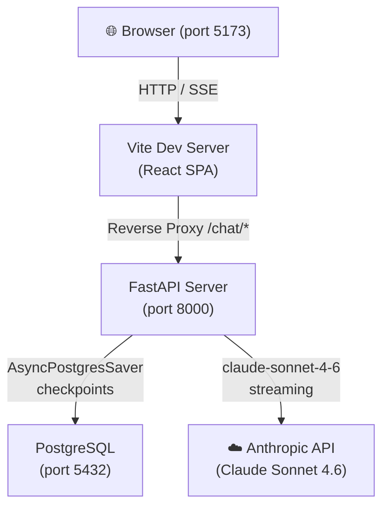

# AI Travel Agent — Production-Grade ReAct Workflow

A full-stack AI travel planning assistant built around **reliability, cost-efficiency, and true stateful persistence**. The project goes beyond a simple chatbot demo: it implements enterprise-grade patterns including a Pre-Tool Guard with self-correction, server-side hard cancellation via `asyncio.Event`, real-time SSE token streaming, and a PostgreSQL-backed LangGraph checkpointer that gives every conversation multi-turn memory — even across browser refreshes — at zero additional LLM cost.

---

## Key Features

### Enterprise Safety & Reliability Guards
- **Pre-Tool Guard with Self-Correction** — A dedicated LangGraph node validates *all* required parameters before any tool executes. If a parameter is missing, it first scans the full conversation history via a targeted LLM extraction call to find values the user already mentioned. Only after that fails does it ask the user — eliminating redundant clarifying questions and preventing hallucinated tool calls.
- **Clarification-First Enforcement** — The system prompt and programmatic guard together enforce a strict contract: the agent *never* invokes `search_flights` or `find_hotels` without explicit confirmation of every required field (origin, destination, dates, passengers). The guard is the programmatic safety net even if the LLM disobeys.
- **Hard Server-Side Cancellation** — Pressing Stop kills the stream client-side *and* signals the backend to halt LLM/tool execution via a process-wide `asyncio.Event` registry. The cancellation is logged to an audit table for observability.
- **Prompt Injection Detection** — Regex-based input validation blocks prompt injection, XSS, SQL injection, and code execution patterns before any LLM call is made.
- **Token Budget & Recursion Guards** — Per-thread cumulative token limits and a LangGraph recursion cap prevent runaway costs. Both are checked pre-flight, before the graph starts.
- **Tool Timeout** — Every tool call is wrapped in `asyncio.wait_for(timeout=5s)`, running in a thread-pool executor to avoid blocking the async event loop.

### Streaming & Real-Time UX
- **SSE Token Streaming** — Responses stream token-by-token directly to the browser using the Fetch ReadableStream API, with a custom `parseSSEBuffer` that handles arbitrary TCP chunk boundaries.
- **Live Tool Visibility** — Tool invocations and their results appear inline in the chat feed as they happen, giving the user full transparency into agent reasoning.
- **Animated UI with Framer Motion** — Message bubbles animate in on arrival, sidebar sessions slide in/out with `AnimatePresence`, and a staggered bouncing `TypingIndicator` signals loading states.

### Statefulness & History
- **PostgreSQL Checkpointer** — LangGraph's `AsyncPostgresSaver` persists the full `MessagesState` after every graph node. Conversations survive server restarts and browser refreshes.
- **$0-Cost History Retrieval** — Loading a previous session calls `aget_state()` — a single PostgreSQL read with no LLM invocation, no token cost, and no latency penalty.
- **Global Session Sidebar** — All past conversations are listed by title (first message) and relative timestamp, fetched via a concurrent `asyncio.gather` query. Switching sessions loads history instantly.

### Language Persistence
- **Automatic multilingual support** — The agent detects the user's language and maintains it throughout the entire conversation, including tool-call retry prompts, error messages, and clarifying questions. Switching to English mid-conversation is explicitly prohibited in the system prompt.

---

## Tech Stack

| Layer | Technology | Purpose |
|---|---|---|
| **Frontend** | React 18 + TypeScript | Component UI |
| **Frontend** | Vite 5 | Build tool & dev proxy |
| **Frontend** | Framer Motion 12 | Animations & transitions |
| **Frontend** | TanStack React Query 5 | Mutation state / `isPending` |
| **Frontend** | uuid | Thread ID generation |
| **Backend** | FastAPI (async) | ASGI web framework |
| **Backend** | Uvicorn | ASGI server |
| **Backend** | Python 3.11 | Runtime |
| **AI Framework** | LangGraph | ReAct agent graph |
| **AI Framework** | LangChain Anthropic | LLM integration |
| **LLM** | Claude Sonnet 4.6 | Language model |
| **Database** | PostgreSQL 15 | Checkpoint & token storage |
| **DB Driver** | psycopg3 (async) | Async Postgres driver |
| **Infra** | Docker Compose | Container orchestration |

---

## Architecture Overview

### System Diagram



### Docker Networking

Three containers run on a shared Docker bridge network. The Vite dev server proxies all `/chat/*` requests to `http://api:8000` — resolved by Docker's internal DNS — so the browser never talks directly to the API, mirroring a production nginx setup and eliminating CORS entirely. The `postgres_data` named volume ensures conversation history survives container rebuilds.

### LangGraph ReAct Loop

```
START → call_model → [tool_calls?]
          ↓ yes
      pre_tool_guard → [all params valid?]
          ↓ yes                  ↓ no (after history scan)
      call_tools          clarifying question → END
          ↓
      call_model → ... (loop)
          ↓ no tool_calls
         END
```

Every node checks the cancellation flag before executing. Checkpoints are written to PostgreSQL after each node, giving the conversation full persistence and resumability.

---

## Getting Started

### Prerequisites

- [Docker Desktop](https://www.docker.com/products/docker-desktop/) installed and running
- An **Anthropic API key** (Claude Sonnet access required)

### 1. Clone the repository

```bash
git clone <repository-url>
cd TravelAgent
```

### 2. Create the environment file

Create a `.env` file in the **root directory** (next to `docker-compose.yml`):

```bash
# .env
ANTHROPIC_API_KEY=sk-ant-...
```

> The `DATABASE_URL` is automatically injected by Docker Compose and does not need to be set manually.

### 3. Build the containers

```bash
docker-compose build
```

This installs Python dependencies in the API container and Node modules in the client container. The `node_modules` are built inside the container to avoid platform-specific binary mismatches between the host OS and the Alpine Linux container.

### 4. Start the stack

```bash
docker-compose up
```

Wait for all three services to report healthy:
```
travelagent-db-1      | database system is ready to accept connections
travelagent-api-1     | Application startup complete.
travelagent-client-1  | VITE ready in ...ms
```

### 5. Open the app

Navigate to **[http://localhost:5173](http://localhost:5173)**.

---

## How to Test the Agent's Capabilities

The following tests are designed to demonstrate the project's core engineering, not just basic chatbot functionality. Run them in order to see each layer of the system in action.

---

### Test 1 — "The Clarification Guard" 🛡️

**What it demonstrates:** The Pre-Tool Guard preventing hallucinated tool execution.

**Steps:**
1. Type: `Find me a hotel`
2. Observe: The agent asks for the destination, check-in date, and check-out date **before** calling any tool.
3. Provide the destination only (e.g., `Paris`).
4. Observe: The agent asks specifically for the missing dates — not destination, which it now knows.
5. Provide dates. Only at this point does the tool call execute.

**What's happening under the hood:** The `pre_tool_guard` node intercepts the LLM's tool call, detects missing parameters, scans the conversation history for any values already mentioned, then asks the user only for what remains. The tool is never invoked until all required parameters are confirmed.

---

### Test 2 — "The Hard Cancel" ⏹️

**What it demonstrates:** True server-side cancellation via `asyncio.Event`.

**Steps:**
1. Type a complex request: `Build me a full 14-day Japan itinerary with flights from Tel Aviv and hotels for every city, including kosher options`
2. As soon as the response starts streaming, click the **■ Stop** button.
3. Observe: The stream stops immediately in the browser.
4. Check the server logs (`docker logs travelagent-api-1`): you will see `[CANCEL] cancellation flag is SET for thread ...` confirming the backend halted before the next node.

**What's happening under the hood:** The Stop button simultaneously aborts the browser's SSE fetch via `AbortController` and sends `POST /chat/cancel`. This sets the `asyncio.Event` for the thread in the `SessionStore`. On the server, `_check_cancel()` is called at the entry of every LangGraph node — the next time the agent would have invoked the LLM or a tool, it raises `TaskCancelled` instead, and the cancellation is logged to the `cancellation_log` table.

---

### Test 3 — "Context Persistence" 🔄

**What it demonstrates:** The PostgreSQL checkpointer maintaining multi-turn memory across page refreshes.

**Steps:**
1. Send a message with specific details: `I want to fly from Tel Aviv to New York on July 20th, 2 passengers`
2. Get the agent's response (it may ask for a return date).
3. **Refresh the browser** (F5 / Cmd+R).
4. Observe: Your previous messages reload instantly (no spinner, no LLM call).
5. Continue the conversation with just: `Return on August 5th`
6. Observe: The agent remembers your origin, destination, departure date, and passenger count from before the refresh — and now has all the parameters it needs to search.

**What's happening under the hood:** After step 2, LangGraph saved a checkpoint to PostgreSQL. After the refresh, `GET /chat/history` calls `aget_state()` — a single DB read costing **$0 in tokens** — and returns the full message history. When you send the follow-up in step 5, the `call_model` node loads the checkpoint and feeds all previous messages to the LLM as context, exactly as if the conversation had never been interrupted.

---

## Key Engineering Challenges Solved

### 1. Preventing Dangling Tool-Call Checkpoints

LangGraph stores state after every node. If the Pre-Tool Guard asks a clarifying question, the checkpoint would contain an `AIMessage(tool_calls=[...])` with no corresponding `ToolMessage` — corrupting context and causing the LLM to hallucinate on the next turn.

**Solution:** The guard returns an `AIMessage` with the **same `id`** as the one it replaces. LangGraph's `add_messages` reducer treats identical IDs as an in-place update, so the dangling `tool_calls` entry is atomically overwritten with the clarifying question. The checkpoint is always in a consistent state.

### 2. Server-Side Cancellation Across Stateless HTTP

A `POST /chat/cancel` is a completely independent HTTP request from the active SSE stream — there is no direct connection between them. Passing cancellation state through the LangGraph `config` dict would require modifying the graph's internal API.

**Solution:** A process-wide `SessionStore` singleton maps `thread_id → asyncio.Event`. The streaming request registers an event on connect; the cancel endpoint calls `event.set()`. The agent polls `event.is_set()` at every node boundary via `_check_cancel()`. This requires zero changes to the LangGraph internals and works correctly in a single-process async server.

### 3. psycopg3 Single-Statement Enforcement

psycopg3 uses server-side prepared statements by default and **rejects multi-statement strings** — `CREATE TABLE ...; CREATE INDEX ...` in a single `execute()` call raises `cannot insert multiple commands into a prepared statement`. This differs silently from psycopg2 and the `psql` CLI, making it a hard-to-diagnose production failure.

**Solution:** Every DDL batch is split into individual `await conn.execute()` calls, one SQL statement each. The `prepare_threshold=0` pool option additionally disables prepared statements for LangGraph's checkpointer queries, which use dynamic parameter counts incompatible with the prepared-statement protocol.

---

## Project Structure

```
TravelAgent/
├── docker-compose.yml
├── .env                        # ANTHROPIC_API_KEY (not committed)
│
├── server/
│   ├── Dockerfile
│   └── app/
│       ├── main.py             # FastAPI routes, SSE event generator, lifespan
│       ├── agent.py            # LangGraph graph, nodes, Pre-Tool Guard
│       ├── tools.py            # search_flights, find_hotels (Pydantic schemas)
│       ├── session_store.py    # asyncio.Event cancellation registry
│       ├── safety.py           # Input validation, budget/recursion constants
│       └── db.py               # Token tracking, cancellation audit log
│
└── client/
    ├── Dockerfile
    ├── vite.config.ts
    └── src/
        ├── common/             # types.ts, colors.ts
        ├── functions/          # streamParser.ts (SSE parser)
        ├── hooks/              # useChat.ts, useThreadId.ts
        └── components/
            ├── atoms/          # Button, Input, MessageBubble, SidebarItem,
            │                   # ThinkingIndicator, ToolEventCard, TypingIndicator
            ├── molecules/      # ChatInput, MessageItem, SessionList
            ├── organisms/      # ChatFeed, ChatHeader, Sidebar
            ├── templates/      # ChatTemplate
            └── pages/          # AgentPage (root)
```

---

> For a deep technical breakdown of every component, design decision, and system flow — including all Mermaid architecture diagrams — see [`ARCHITECTURE.md`](./ARCHITECTURE.md).
# TravelAgent
